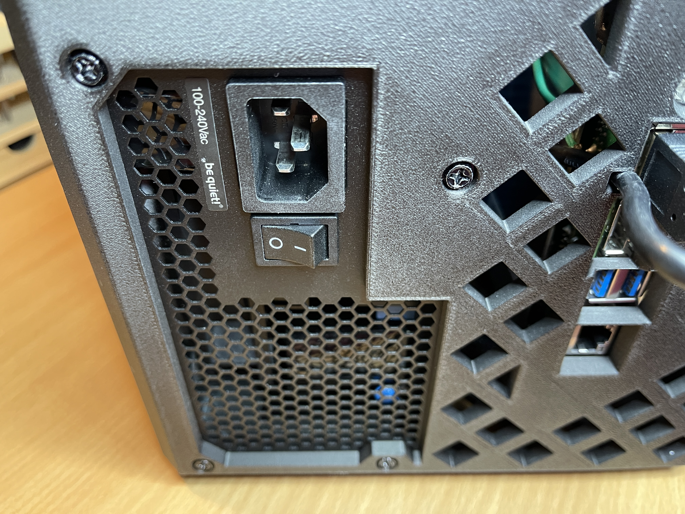

BC-250 Case
===========
&copy; 2026 by Tony Fabris

A 3D Printed case for a BC-250 gaming system, with a full sized ATX power supply and a docking area for a 2026 Steam Controller.

  

|  |    |
|:-------------------------------:|:--------------------------------:|

|  |
|:--------------------------:|

Project Links
-------------
- [Main Project Details](         ../README.md)
- [LED Controller](               ../LED%20Controller/README.md)
- [Steam Puck Controller Wake](   ../Steam%20Puck%20Controller%20Wake/README.md)
- [Case](                         ../Case/README.md)

Table of Contents
-----------------
- [Case Design](           #case-design)
- [Exporting 3D Files](    #exporting-3d-files)
- [Scooper Tool](          #scooper-tool)
- [3D Print Settings](     #3d-print-settings)
- [Assembly](              #assembly)

Case Design
-----------

Printed in PLA, the case splits in two halves down the middle with a zig-zag connection lip between the two halves. The two halves of the case are held together with two M3 hex bolts (one on top and one on the bottom) and corresponding M3 heat-set threaded inserts. The BC-250 card slots into the gripping points in the case without screws. The rear panel has holes cut for the BC-250 ports and for the particular brand/model of power supply that I used. Front panel has an angled section for docking a 2026 steam controller to its magnetic puck. Also included are a clip/shroud to attach a 120mm fan above the heatsink of the card, and a snap-on carrying handle.

|       |     |
|:-------------------------------------------:|:-------------------------------:|
|  |  |

### Front Panel Badge

There's a translucent Steam logo badge on the front of the case, also 3D printed, with PCB standoffs and the necessary openings for adding a PCB, for making the badge light up with LEDs. The badge also doubles as a power button. More details and assembly notes for the front badge and button system can be found in the [LED Controller](../LED%20Controller/README.md) section of this project.

Exporting 3D Files
------------------

Refer to the following file in this repository (open it in Blender):

- "BC-250 Case.blend"

I have included the original Blender working file, to make it easier to make any desired modifications before printing. I'm still on Blender version 3.2, so your steps might differ.

### 3D Print Toolbox Add-On

In Blender, enable the "3D Print Toolbox" add-on:

- Edit, Preferences, Add-ons, search for "Toolbox", enable "Mesh: 3D-Print Toolbox".

### Possible Modifications

You might need to modify the case design in Blender for various reasons. I would look at these as possible places for modification:

- The rear panel hole is carved to match the vents on my ATX power supply, which is a "Be Quiet!" brand [Pure Power 13](https://www.amazon.com/dp/B0FBX9VS3B). Yours may need a different shape for that hole.
- The screw standoffs which hold the perfboard to the front of the case might need to change diameter or depth to match the screws, the perfboard, and the buttons that you're using.
- ***IMPORTANT:*** There are a lot of boolean modifier operations which are still live boolean meshes; they haven't been "applied" to the objects yet. Leaving them live allows for more modifications to be made. But use care when editing: Don't move an object out of place without ensuring that its corresponding boolean objects are moving correctly along with it.

### Select and Export Objects

When ready to print, export each of the objects listed below, from the Outliner. In the Outline, right-click on the object and press "Select Hierarchy" so that only that object and its children are selected. Then export them: With the object and its children selected/highlighted, press N to make the item panel appear and select the "3D-Print" tab, choose Format: STL, and press the Export button. The STL file should appear in the same folder as the Blender file.

  |  |
  |:----------------------------------------:|

#### Main Case Front
- Select and export.
- ***Important:*** Make sure to use "Select Hierarchy", so that the export includes these child objects, so that they print as a single unit:
  - Board Front Slot Bottom
  - Board Front Slot Top
  - Connection Lip
  - LED Controller Mount

#### Main Case Back
- Select and export.
- ***Important:*** Make sure to use "Select Hierarchy", so that the export includes these child objects, so that they print as a single unit:
  - ATX Bottom Support
  - Back Corner Slot Lower
  - Back Corner Slot Upper
  - Board Middle Slot Bottom
  - Board Middle Slot Top

#### Handle
- Select and export.

#### Fan Shroud
- Select and export.

#### Steam Logo Black
- Select and export.
- This is a single object, but it has three separated pieces to it, for printing flat to the bed.

#### Steam Logo White Backing
- Select and export.

#### Steam Logo Clear
- Select and export.

Scooper Tool
------------

Obtain the file for the BC-250 Scooper and print it along with the other parts. It is a fin-bender tool for unfolding the BC-250 heat sink fins. Unfolding the heat sink fins is ***very important*** to keep the BC-250 cool with the 120mm fan. This is an absolute genius tool, it makes the job much easier and the results are cleaner than any other method I've seen.

- Link to Scooper tool: https://www.printables.com/model/1282906-bc-250-scooper
- Mine did well when printed in PLA-CF, the carbon fiber helped keep it tough, so it didn't wear out too quickly. I was able to do all the heat sink fins with one print of the tool.
- Only the fins directly above the CPU, where the fan snaps on, need to be unfolded, as shown:  

  |  |
  |:---------------------------------:|

3D Print Settings
-----------------

### General Settings

I am printing on a Bambu X1 Carbon, so your settings may differ from mine. When printing the main case parts, To allow for supports to be more easily removed, I am making these changes to the default support settings in Bambu Studio:

- In the Process pane, turn on ADVANCED
- Support, Enable Support
- Support, Top Z Distance, increase from 0.24 to 0.25
- Support, Top Interface Layers, increase from 2 to 3
- Support, Support/Object Xy Distance, increase from 0.35 to 0.4

### Print Orientation and Supports

#### Main Case Back
- Print in PLA, whatever color you like.
- In Bambu Studio, press the "Lay on Face" button, then select the face which is the flat back side of the case where the holes for the I/O ports are.
- ENABLE automatic supports with the general settings described above. The only part that should get supports is the four screw holes for the ATX power supply.

  |  |
  |:-------------------------------:|

#### Main Case Front
- Print in PLA, whatever color you like.
- Press the "Lay on Face" button, then select the face which is the flat front side of the case where the indentation for Steam logo badge is.
- ENABLE automatic supports with the general settings described above. This will add supports for the indentation for the Steam logo badge, the flat horizontal face near the controller dock area, the slot for the controller puck cord, and the edges of the connection lip.

  |  |
  |:--------------------------------:|

#### Handle
- Print in PLA, whatever color you like.
- Press the "Auto Orient" button.
- ENABLE supports.

#### Fan Shroud
- Print in PLA or PETG, whatever color you like. Mine is currently doing OK in PLA, but I am concerned about how warm the BC-250's heat sink might get under heavy load. Consider printing this in PETG, to ensure it lasts longer when clipped to a hot heat sink.
- Press the "Auto Orient" button.
- ENABLE supports.

#### Steam Logo Black
- Print in PLA, in black.
- Press the "Lay on Face" button, and select the face which would face forward, so that the texture of the print bed becomes the texture of the outward/forward-facing direction of this part.
- DISABLE supports.
- Also set:
  - Strength, Top surface pattern: Concentric
  - Strength, Bottom surface pattern: Concentric
  - Strength, Internal solid infill pattern: Concentric
  - Strength, Sparse infill pattern: Concentric

#### Steam Logo Clear
- Print in clear TPU or clear PLA. I used TPU because that's the clear filament that I had on-hand, and it works, but PLA would be fine too. This has a shiny appearance, which has a certain appeal, but the transmitted glow from the LEDs is somewhat uneven.
- Press the "Lay on Face" button, and select the face which would face backward, so that the spot where the LEDs will go, and the back side of the logo, is facing down toward the print bed.
- ENABLE automatic supports with the general settings described above.
- Also set:
  - Strength, Top surface pattern: Concentric
  - Strength, Bottom surface pattern: Concentric
  - Strength, Internal solid infill pattern: Concentric
  - Strength, Sparse infill pattern: Concentric
- After printing, ensure you dig all the support material out of the holes for the LEDs.

- Optional / Alternative: Print in clear ***resin***, ideally a translucent mixture, obtained by mixing 90% clear resin and 10% white resin. This is much more difficult to get right, it requires a lot more fiddling and postprocessing, and it won't fit with the other parts properly unless you use use the Tolerance Compensation features of your slicer and do a lot of sanding. I don't recommend this method because of the amount of hassle, but I prefer this appearance.
- If you're printing this in resin, I recommend printing it in the same orientation as the PLA version, with the back side of the logo facing toward the print bed and raft/supports. You'll probably need to sand away a lot of support dots and some messy blobbiness on the back side of the logo to make it properly flat and smooth again, but the user-facing side should look clean and crisp.

  |  **Clear TPU / PLA (easy)** |  **Clear Resin (hassle)** | 
  |:--------------------------------------------------------:|:--------------------------------------------------------------:|

#### Steam Logo White Backing
- Print in PLA, in white.
- DISABLE supports.
- Press the "Lay on Face" button, and select the face which would face forward, so that the texture of the print bed becomes the texture of the face that will face forward.
- The goal here is to try to make it print exactly 3 layers in a thin sheet, for a part that is 0.36 mm thick, but still have it be a workable object. In Bambu Studio, the settings below will give you a strong 0.20 mm foundation to stick to the bed, followed by two fine 0.08 mm layers for a total of 3 layers with no infill. (0.20mm base layer + two 0.08 sheets = .36mm total).
  - Quality, Layer height: 0.08 mm
  - Quality, Initial layer height: 0.20 mm
  - Strength, Top surface pattern: Concentric
  - Strength, Top shell layers: 3
  - Strength, Bottom surface pattern: Concentric
  - Strength, Bottom shell layers: 0
  - Strength, Internal solid infill pattern: Concentric
  - Once sliced, look at the Preview tab. Use the slider on the right side of the screen to scroll up and down. Verify that the line counter maxes out at exactly Layer 3 and that the layers look like what you expect.

Assembly
--------

### Install back side heat sink

The back side of the BC-250 is a blank metal plate which covers up the RAM chips. To ensure those components don't overheat under heavy load, use thermal epoxy to permanently glue a plain heat sink to the blank metal plate. 

- The heat sink I used was 150x120x20mm: https://www.amazon.com/dp/B0C7RTSM6S
- I carefully measured and cut four holes into the heat sink so that I could still access the mounting screws in the future.
- I also removed a particular couple of fins on the top side of the heat sink which line up with the 3D-printed case, at the spot where the case screw with the heat-set threaded insert protrudes inside the casing, so that it wouldn't interfere.
- The thermal expoxy I used was: https://www.newegg.com/alphacool-1020421/p/37B-0003-00837)
- Spread the thermal epoxy as evenly as possible over the entire heat sink. This is not the same as thermal grease on a chip, you don't do an X or a blob, you want it spread thinly and evenly over the whole thing before sticking it onto the aluminum plate.
- I shouldn't have to say this, but ***allow the thermal epoxy to fully cure*** before continuing with assembly. Read the label to find out the curing time.

  |  **Drilled and Thermal Glued** |  **Make Room for Case Screw** |
  |:-------------------------------------------------------------------------:|:----------------------------------------------------------------------:|

### Remove brackets

In my case design, the BC-250 is held in place by several slotted mounting points, so the mounting brackets built onto the BC-250 are not needed.

- Remove the rear I/O plate cover/bracket from the BC-250. It's a couple of screws and some sticky RF shielding around the ports.
- Optional: Remove the upper front corner bracket from the BC-250. It's two screws right next to each other. Though my case design still works with the bracket in place, having the bracket there makes things awkward during assembly (some of these photos were taken before I made the decision to remove mine).

### Install the CPU fan onto the BC-250

- Make sure you unfolded the tops of the BC-250's heat sink fins using the scooper tool as described earlier.
- Attach the fan to the shroud using the screws that came with the fan. Ensure that the fan blows in the correct direction, it should blow air directly onto the unfolded heat sink fans. To find out: If you peer carefully, your fan may have some faint arrows on one side of it, which indicate the fan rotation direction and the airflow direction.
- If needed, set the fan speed, using the switch on the fan before clipping it onto the card. My fan came with a little switch that lets you choose between M, HS, and UHS, with each setting making the fan run faster and louder. The BC-250 will automatically throttle the GPU if it gets hotter than 85°c. You will be able to get faster frame rates with higher fan speeds, but it will be noisy. The M setting is very quiet even at full speed. The HS setting is quite noisy at full speed, but it results in about 12 FPS faster frame rates in FurMark tests.
- Clip the fan around the heat sink and the circuit board. The clips should go around the green circuit board, but not the metal back plate.
- Slide the fan and shroud assembly into position, so that the clips rest against the "protrusion" in the BC-250's green PCB, and so that the fan is directly over the unfolded part of the BC-250's heat sink.

|  **Screw Fan to Shroud**         |  **Snap Shroud to Card** |
|:---------------------------------------------------------------:|:--------------------------------------------------------------:|
|  **Clips Go Around PCB** |  **Slide Shroud up to Protrusion**      |

### Install the wiring connections to the BC-250

- Make sure the wires for the [Controller Wake circuit](../Steam%20Puck%20Controller%20Wake/README.md) which connect to the BC-250 are in place, which are the connection to the TPMS1 header and the wires soldered to the power button pin and its nearby ground point.
- Make sure you are connecting to the correct pin on the TPMS1 header. The pinouts are [here](https://elektricm.github.io/amd-bc250-docs/hardware/pinouts/#tpms1-lpc-header), you want the "3v" pin, see photo below.
- Connect the PCIe power connection from the ATX power supply to the J1000 receptacle on the BC-250. For my power supply, it was a cable with a 12-pin connector at one end (plugging into the PCIe plug on the power supply) and an 8-pin (6+2) connector at the other end, labeled "VGA": all eight of those 6+2 pins go into the J1000 plug on the BC-250.
- The PCIe power plug is most easily installed *before* sliding the card into the rear case. If you put the card into the case first, you won't have much space to work the PCI-E power connection into the BC-250 board.
- Also fit the LED sense pin connector to the J2000 receptacle on the BC-250, for the [LED Controller](../LED%20Controller/README.md). J2000 has more room than J1000 has, so this could be done later if needed, as long as you make sure to do it before closing up the front of the case.
- Route the cable from the CPU fan so that it is tidy and won't get tangled as you insert the card into the case. Connect it to the CPU fan header plug, CPU_FAN1.

|  **TPMS1 Pin**             |  **TPMS1 Connection**       |
|:--------------------------------------------------------------------:|:---------------------------------------------------------------------:|
|  **TPMS1 Connection**      |  **Power Button**  |
|  **PCIe Connector goes to J1000**  |  **J1000, J2000, and CPU_FAN1**  | 

### Install the heat-set threaded inserts into the case

There are only two spots for heat-set threaded inserts in the case, one on the top and one on the bottom. This is a good video describing how to use these: https://www.youtube.com/watch?v=P7nHyI1TwKY

The inserts go into the **front** of the case, into the existing provided holes, in the "connection lip" protruding from the edge of the front of the case.

|   | 
|:------------------------------------------------:|

### Install the BC-250 and the power supply into the case

- Before sliding it into place, make sure the USB cable from the Controller Wake circuit is poking out the notch next to the USB ports on the back of the case.
- Practice inserting the BC-250 into its mounting slots while the ATX power supply is not yet installed, so that you have a feeling for where the corners of its circuit board go, and can ensure that its I/O ports all line up. It's easier to see this when the power supply is out of the way.
- Remove the BC-250 and install the ATX power supply, using the four screws that came with it.
- Slot the BC-250 into its final position.
- Ensure the two rear corners of the BC-250's green PCB are seated in the mounting slots, and that the middle lower PCB protrusion near the power connector is in its mounting slot.
- Make sure that no wires get crunched as you're slotting it into place. In particular, make sure that the wires soldered to the power button pins or connected to the TPMS1 connector don't get yanked out.

|  **Controller Wake** |  **Middle Lower Mount**   |
|:----------------------------------------------------------------------:|:----------------------------------------------------------:|
|  **Rear Upper Mount**                   |  **Rear Lower Mount**       | 
|  **ATX Mounted**                                 |  **I/O** |

### Install the badge and LED circuit

- Insert the black parts into the front of the clear badge. The black parts should pressure-fit into the clear part, but can be glued if needed. I had to glue the largest of the three black pieces on mine, but only in the resin version.
- Place the white backing onto the back side of the clear badge, it should be loose and rattle around.
- When assembling the badge, remember that all parts of that assembly are directional, and in two axes. If it seems like something is not quite centered on the logo circle, try rotating and flipping it around in either or both of its axes until it sits perfectly.
- Test fit all the badge parts before mounting anything permanently.
- Ensure the LEDs fit into the holes in the badge. They should be loose so that the badge can move a little bit, so that it can act as a button.
- Once everything's fitting, install the LED perfboard into the front of the case with four M2 x 10mm self-tapping plastic screws. The screws need to be the correct size to fit the standoffs, or they'll split the plastic standoffs open (you could also modify the standoffs to fit your desired screws before printing the front of the case). 
- Carefully install the badge itself, with its white backing in place, using two small squares of [Alien Tape](https://www.amazon.com/dp/B083C5WXWV). The Alien Tape goes into the rectangular gaps in the backing, as shown in the photos.
- It's important to use very small pieces of Alien Tape, because it is very strong, and because the badge still needs to move a little bit to actuate the buttons.
- The badge should be slightly loose in its hole, the LEDs should be slightly loose in the holes in the back of the badge, and the badge should be able to rock up and down. The Alien Tape squares are the fulcrum of its rocking motion. Pressing the top or the bottom of the badge should click the corresponding pushbutton on the LED controller.

|  **LED / Badge Parts**         |  **Test Fit Everything** |
|:--------------------------------------------------------------------------:|:--------------------------------------------------------------------:|
|   **Four M2 Screws**                  |    **Mounted in Case**       |
|  **Alien Tape in Rectangluar Gaps** |       **Install Carefully**     |

### Prepare for the final case closure

- Ensure the USB-C connector for the Steam Puck is correctly dangling out of the slot on the front side of the case, and snug it into position.
- Prepare the wiring to be tucked away into the empty area in the front of the case. 
- ***USE EXTREME CAUTION*** when tucking the wires away:
  - Ensure wires do not interfere with the CPU fan or ATX power supply fan.
  - Ensure wires do not block the mounting points that the card slots into.
  - Ensure bare wires and circuits do not touch each other, nor any metal parts.
  - Recommended: Wrap the Controller Wake circuit in Gaffer tape to prevent it grounding out on items in the case (**specifically Gaffer tape** which is designed not to leave a sticky residue on things the way that duct tape or other tapes would do).
  - Ensure the fan shroud is slid fully into position over the unfolded part of the heat sink. It should be slid as far forward onto the card as it can go, with its clip touching the protrusion on the bottom edge of the card. The fan can slip out of place a bit during assembly, so make sure it's in the correct position before buttoning up the case.

|  **Puck**        |  **Careful with Wires**    |
|:-----------------------------------------------------------:|:----------------------------------------------------------------:|
|  **Gaffer Tape** |   **Fan Shroud Fully Forward**  |

Put the case front on, and close the case.

- Ensure the front corners of the BC-250 slot into the mounting points in the front of the case.
- Ensure no wires get caught in the connection lip between the two cases.
- Ensure no wires get caught in the mounting points in the front of the case.
- Ensure wires are clear of the points where the screws hold the two halves of the case together, where the screws protrude past the heat-set threaded inserts into the case.
- Ensure the screws and the heat-set threaded inserts are not interfering with any components inside the case. In particular, the top screw can protrude down and hit the backside heat sink. Make modifications if needed.

|  **Front Lower Mount**  |  **Front Upper Mount** |
|:-------------------------------------------------------:|:------------------------------------------------------:|
|  **Heat-Set Threaded Inserts** |                                  |

### Rubber Feet

Make sure to add four self-adhesive rubber feet to the bottom of the case. This helps keep it from sliding around, protects the surface of the shelf it's sitting on, and lifts the case slightly above the shelf, allowing the underside ventilation holes to draw in air.

- Example: https://www.amazon.com/dp/B075F1HW3S 

|   **Rubber Feet** |  **Air Gap Underneath** |
|:-------------------------------------------------:|:----------------------------------------:|

### Handle

Optional: Snap the handle in place, positioning it over the case's center of gravity.

