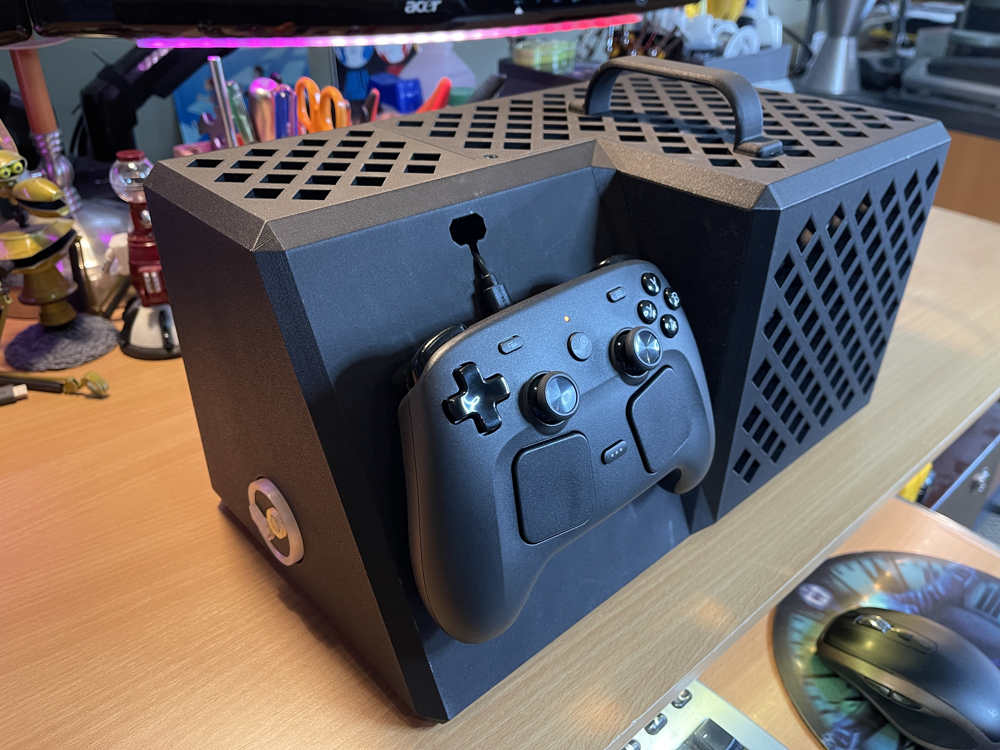

BC-250 Steam Gaming Console
==============================================================================
&copy; 2026 by Tony Fabris

Building a budget gaming console out of an ASRock BC-250 crypto mining card. It runs Bazzite and Steam. This is my documentation, 3D printing files, source code, reference links, and other notes for this project.

***Bonus: [Wake From Controller! Click Here!](Steam%20Puck%20Controller%20Wake/README.md)***

|     |           |
|:-------------------------------:|:------------------------------------:|
|  |   |

|  |
|:-----------------------:|

Project Links
-------------
- [Main Project Details](         README.md)
- [LED Controller](               LED%20Controller/README.md)
- [Steam Puck Controller Wake](   Steam%20Puck%20Controller%20Wake/README.md)
- [Case](                         Case/README.md)

Table of Contents
-----------------
- [Background](            #background)
- [Parts](                 #parts)
- [Build Notes](           #build-notes)
- [OS Installation](       #os-installation)
- [Unlock 40 GPU Cores](   #unlock-40-gpu-cores)
- [Unlock 8 CPU cores](    #unlock-8-cpu-cores)
- [Tips and Tricks](       #tips-and-tricks)
- [To-Do List](            #to-do-list)
 

Background
----------

In 2026, Valve Software released the [GabeCube](https://en.wikipedia.org/wiki/Steam_Machine) at the height of the [rampocalypse](https://en.wikipedia.org/wiki/2025-present_global_memory_supply_shortage). I wanted one, but didn't get one, due to the fickle nature of their release-day lottery. I managed to get a Steam Controller, but alas, not the game console to go with it. How sad is that? I'm on the waiting list to maybe get one in... 2027 some time? Instead of sitting around for a year, I decided to make one. I'd stumbled across information about how to [turn a surplus BC-250 into a gaming console](https://elektricm.github.io/amd-bc250-docs/getting-started/introduction/) and felt like this would be a fun project. It turned out well, and it was indeed quite fun (though, at times, *Type 2* fun).

#### Advantages

- The delicious irony of using a leftover crypto mining card to make a gaming PC.
- Cheap! I ended up spending about $500 USD on parts, which is less than half the price of a Valve Steam Machine, and significantly less than the price of a Playstation 5, at the current time. Computer prices are being pretty terrible at the moment.
- Lots of rabbit holes to go down, new things to learn and experience.
- Because I made it myself, I have more freedom to modify it and experiment with it, things I wouldn't do with an actual Steam Machine.
- I got to design and [3D print my own case](Case/README.md).
- I got to build my own custom electronics for the [LED indicators and power buttons](LED%20Controller/README.md) on the front of the case, and for the [wake from controller](Steam%20Puck%20Controller%20Wake/README.md) USB adapter.

#### Disadvantages

- The BC-250 does not have a sleep mode, nor any built-in way to control its attached power supply. For mine, I'm leaving the power supply turned on at all times, and turning the BC-250 completely on and off without a sleep mode.
- The cooling fan can still be noisy when the BC-250 is under heavy load, if you have configured your fan speeds for high performance. If you configure the fan to be quiet, the GPU will automatically throttle based on temperature, and you'll lose about 12 FPS under a full graphics load.
- It is not as performant as a Steam Machine would have been. But it's not bad! Most games run well at 1080p, and I sit far enough away from my TV set that I can't tell much of a difference between 1080p and 4k. 
- Physically, it's not as small or pretty as a Steam Machine. But it's kinda cool looking, in its own way, and I'm proud of the design. It fits on the shelf next to my PlayStation perfectly, which is enough for me.

Parts
-----

Links and prices are just examples, are approximate, and are temporary. Note that in most cases I spent extra for fast shipping, which drove the prices up. For example, the main card was only $165.00, but I spent an extra $30.00 on shipping. Some of the parts, such as the power supply, are overkill for what was actually needed, I could have chosen cheaper components.

Prices are from August 2026, and do not include shipping:

- Surplus ASRock BC-250 Crypto-mining Card: [≈165.00 Ebay](https://www.ebay.com/itm/178370111924)
- Be Quiet! Pure Power 13 750w ATX power supply: [≈90.00 Amazon](https://www.amazon.com/dp/B0FBX9VS3B)
- Be Quiet! Silent Wings Pro 4 120mm cooling fan: [≈29.00 Amazon](https://www.amazon.com/dp/B0B746VB2F)
- PTM7950 thermal pad: [≈36.00 Amazon](https://www.amazon.com/dp/B0BX45ZS8H)
- Upsiren UTP-X Thermal Putty: [≈50.00 Amazon](https://www.amazon.com/dp/B0CSZ7R2XW)
- LiebeWH 150x120x20mm Aluminum Passive Heat Sink: [≈14.00 Amazon](https://www.amazon.com/dp/B0C7RTSM6S)
- Alphacool Core 2-Part Heat Conducting Adhesive: [≈12.00 NewEgg](https://www.newegg.com/alphacool-1020421/p/37B-0003-00837)
- Patriot P300 M.2 PCIe Gen 3 512GB SSD: [≈80.00 Amazon](https://www.amazon.com/dp/B082BJ4679)
- Ugreen Active DisplayPort to HDMI Adapter: [≈20.00 Amazon](https://www.amazon.com/dp/B0FQCGSWW3)
- Kinivo BTD500 Bluetooth 5.0 Adapter: [≈14.00 Amazon](https://www.amazon.com/dp/B0BQYL2PK3)
- Molex 44769-0801 Micro Fit connector (for LED badge): [≈5.00 DigiKey](https://www.digikey.com/en/products/detail/molex/0447690801/513218)
- ATX 24-pin power socket connector (for LED badge): [≈2.00 SparkFun](https://www.sparkfun.com/atx-power-supply-connector-right-angle.html)
- ESP32 S2 Mini ESP32-S2FN4R2 (for Controller Wake): [≈5.00 Amazon](https://www.amazon.com/dp/B0B291LZ99)
- TS3USB221E USB Multiplexer Board (for Controller Wake): [≈5.00 Amazon](https://www.amazon.com/dp/B099NPVWP3)
- Snappable PC Prototype board (for LED and Wake circuits): [≈5.00 Amazon](https://www.amazon.com/dp/B081QYPHHP)

### Alternative Parts

Some other parts which could have been used, but which I chose not to use.

- Apevia ITX-PFC500W Mini-ATX power supply: [≈63.00 Amazon](https://www.amazon.com/dp/B0CWN59YCZ)

  I chose to use a full ATX power supply instead of this one. This one has a small but noisy cooling fan which runs all the time, whereas my ATX power supply has a larger, quieter fan which hardly ever turns on at all.

- Benefei 4K DisplayPort to HDMI Cable: [≈10.00 Amazon](https://www.amazon.com/dp/B07Y1XM998)

  I had one of these on-hand already. It worked for standard video and audio. But when I tried to use HDR (high dynamic range) video, it caused a malfunction, making the screen colors appear washed-out and grayish. The problem was solved by switching to the Ugreen adapter listed above.

- Plugable Active DisplayPort adapter: [≈20.00 Amazon](https://www.amazon.com/dp/B00S0C7QO8)

  I had one of these lying around, and tried it. Do not use one of these: it worked with HDR, but it didn't transmit audio to the TV.

- AX900 USB WiFi 6 and Bluetooth 5.3 Adapter: [≈10.00 Amazon](https://www.amazon.com/dp/B0DWHWTJMY)

  Because the BC-250 comes with an ethernet port, I did not need to have a WiFi adapter on it. I went with a Bluetooth-only adapter which gave me better signal reception for my keyboard and mouse.

### 3D Printed Parts

- Custom case [details here](Case/README.md).
- Fan attachment bracket [details here](Case/README.md#install-the-cpu-fan-onto-the-bc-250).
- Scooper tool (for bending the heat sink fins): [Link on Printables](https://www.printables.com/model/1282906-bc-250-scooper)

### Custom Electronics

- LED Controller [details here](LED%20Controller/README.md).
- Steam Puck Controller Wake [details here](Steam%20Puck%20Controller%20Wake/README.md).

### Parts On-Hand

In addition to the itemized parts above, I already had on-hand these other things, which were needed for building this system:

- Rubber feet for the bottom of the case, required for ventilation.
- M3 screws and heat-set threaded inserts, for holding the case together.
- 3D printer, for printing the case.
- Electronic components such as resistors, diodes, transistors, LEDs, etc., for building the LED badge and controller wake projects.
- Soldering tools, flux, shrink tubing, etc., for building the LED badge and controller wake projects.
- HDMI cable.
- USB keyboard and mouse for initial system setup.
- USB stick for BIOS flashing and installing the operating system.
- Steam Controller for gaming.
- Bluetooth keyboard and mouse, and lap desk, for using on the couch with keyboard+mouse games.

Build Notes
-----------

### Links to Full Instructions

  - https://www.youtube.com/watch?v=ajZCscNZbE8
  - https://elektricm.github.io/amd-bc250-docs/
  - https://www.tiktok.com/@techmakesart/video/7590136601234246943 (BIOS instructions)

### ATX Power Supply

I'm choosing a "Be Quiet!" brand full ATX power supply because it's quiet, and its fan doesn't even turn on most of the time.

Plug the PCIe 8-pin (6+2 pin) power cable from the ATX power supply into the BC-250's 12V power receptacle, which is labeled "J1000" on the board. Do not use a 6-pin to 8-pin adapter: Under full load, the board can pull 300+ watts, which is too much for a  6-pin connector. Mine is a 12-pin connector coming from the "PCIe" connector of my ATX power supply, which turns into a 6+2 connector, all 8 pins of which plug directly into the J1000 plug on the BC-250. It took me a while to figure out which cable was the correct cable to use, but the cable did indeed come with the power supply, it was labeled "VGA". 

|  **One end connects to PCIe plug on ATX** |  **Other end connects to J1000**  |
|:------------------------------------------------------------------------:|:-----------------------------------------------------------------------------:|

The BC-250 does not have any circuits for powering on the attached ATX power supply. An ATX power supply will not supply any power without a signal to turn it on. I am using a jumper connection, so the power supply is always-on, shorting the PS_ON pin to a nearby ground pin. The pins to use are the 3rd and 4th pins on the "clip side" of the 24-pin connector (which are pin numbers 15 and 16). The jumper is on the the female ATX connector that I bought, and which I'm using for other connections as well. Refer to this illustration:

  https://www.etechnophiles.com/wp-content/uploads/2023/02/ATX-power-supply-connector-pinout-768x441.jpg

### Buttons and Power

The BC-250 has two modes for handling its onboard power circuit. There is a jumper on the board to choose between two modes. The jumper is labeled "AUTO_PWRON1" and it has three pins (as with all jumpers, Pin 1 is marked with a small triangle on the board).

  - Jumper on Pins 1-2: "Auto power-on" mode - BC-250 turns on whenever 12v is received from the ATX power supply (use when you want to use a toggle switch to turn the ATX power supply on and off). 

  - Jumper on Pins 2-3: "Wait for power button" mode - BC-250 does not turn on until its power button is pressed (I am using this method).

I'm using the second mode, the "Wait for power button" mode. Then I am jumpering the ATX power supply's PS_ON pin so that it's on at all times, and using fancier methods for turning the BC-250 and off. This mode also keeps the BC-250's USB ports energized while the ATX power supply is on. I'm using this configuration so that I can have the BC-250 charge my Steam Controller via its USB puck and allow it to wake the system with a [special circuit](Steam%20Puck%20Controller%20Wake/README.md).

The BC-250 has two lit buttons on its back panel next to the I/O ports. These are momentary pushbuttons. One is its power button and the other is its reset button. The power button glows green, the reset button glows blue and is recessed slightly. These buttons are not usually easily reachable, and the BC-250 doesn't have a convenient connector for an additional power button. In my situation I am creating my own power button for the front of the case, which involves soldering an extension wire to the PCB pads for these buttons.

On my system, I have soldered a wire pair to the power button and a ground. This wire runs up to the front of the case, to a momentary pushbutton which can turn the machine on and off from its front side, hidden under the translucent "Steam" badge on the front of the case, so that pressing the badge will turn it on. A momentary press will either turn on the BC-250, or trigger a graceful shutdown. A long press will force a hard shutdown.

I don't usually need to access the reset button, so I am only soldering my wire to the power button pad, I'm not connecting anything to the reset button pad. I'm also using this same wire to connect to my [wake circuit](Steam%20Puck%20Controller%20Wake/README.md).

Picture of power and reset button pads:

  - https://preview.redd.it/bc-250-leds-and-buttons-external-connection-v0-zhf600q05jkg1.jpg?width=1080&crop=smart&auto=webp&s=7752a4f8e174ec4e137aa87ecfac404336e7c129

Alternative method, if you're feeling extremely adventurous. I did not do this, because it seemed more risky and would have caused complications for my controller-wake circuit:

  - https://www.youtube.com/watch?v=jIhgyB8x3fQ
  - https://www.reddit.com/r/BC250Gaming/comments/1s4yi8s/reverse_engineered_the_power_circuitry_modified/

### CPU Cooling

The BC-250's built-in heat sink was originally designed so that it works in a rack with other cards, with cooling intended to be air blowing through the rack case from front to back. So its heat sink fins are a like closed-off tubes.

To improve cooling, it is recommended to bend the heat sink fins in the area above the APU. I had really good luck with printing this absolutely genius [BC-250 Scooper Tool from Printables](https://www.printables.com/model/1282906-bc-250-scooper) and using it to bend up the heat sink fins.

Then I 3D printed a mounting attachment to mount the 120mm cooling fan directly to that section of the heat sink. More details in the [case assembly](Case/README.md) section of this project.

|  **This Thing is Genius** |  **Fan Clips Over Unfolded Fins**  |
|:-------------------------------------------------------:|:---------------------------------------------------------------------:|

### Fan speed:

I'm using a "Be Quiet!" brand Silent Wings Pro 120mm fan to keep the processor cool, combined with unfolding the heat sink fins with the scooper tool. This fan has a switch that lets you choose between M, HS, and UHS fan speeds (M is lowest, HS is middle, and UHS is highest). This switch is an overall speed control, and the BIOS fan speed settings are a percentage of that overall speed setting. 

The BC-250 will automatically throttle the GPU if it gets hotter than 85°c. It should theoretically top out at that temperature and not go much beyond that, even under full load. If you set the fan to a higher setting, it will be noisy on graphics-heavy games, but you'll get faster FPS because it can keep the chip cooler. Under full load, the M setting is very quiet and the HS setting is quite noisy. I measured a difference of about 12 FPS in FurMark tests, between the M and the HS settings. I'm leaving mine on HS for now.

### RAM Cooling

The back side of the BC-250's board contains its RAM chips underneath a flat aluminum plate. To ensure that the RAM stays cool, I have used thermal adhesive to attach a large heat sink to that area of the aluminum plate. Note that before gluing the heat sink into place, I drilled holes in the heat sink where it would have covered up access to the mounting screws. It's important not to lose access to those screws.

  |  |
  |:----------------------------------------:|

### Replacing Thermal Pads

There is a lot of discussion about replacing the thermal pads on the BC-250. Folks suggest using a piece of 0.25mm thick PTM7950 thermal pad on the central processor. I did this for mine, and for a brief, shining moment, it resulted in a very slight increase in FPS at the 85°c thermal throttle point. I measured about a 4% increase in FurMark, increasing the frame rate from about 109 FPS to about 114 FPS.

This tiny increase might not be worth the effort. It's a messy, tedious, difficult job, the materials are needlessly expensive, and you run the risk of damaging the board. This video shows the procedure, and they make a good case for *not* doing this procedure, and just leaving the thermal pads as-is: https://youtu.be/FJapqZSdt6I

If you're going to do this, don't just buy the PTM7950, which is only useful on the main CPU. You also need thermal putty, such as Upsiren UTP-8 or UTP-X. There are many components with various thick blobs of thermal putty on them, and some of it peels up as you're removing the heat sinks. This putty might also need replacing, and the thin sheets of PTM7950 are not nearly thick or plentiful enough to fill the gaps between these components and the heat sink. Make sure you get enough of the stuff, it comes in the tiniest little jar: when it arrived, I thought they'd sent me the wrong size. I would say the 50g size would be maybe barely enough, and the 100g size would give you extra just in case.

At first I had done just the PTM7950 on the CPU, but then, I worried that I was going to fry the other components if I didn't get in there and replace their putty too. So I got the UTP-X thermal putty and redid the entire thing, replacing the original putty in all the other spots on the board as well as re-replacing the PTM7950 on the CPU. (Every time you peel off the heatsink, you must replace the thermal pad on the CPU, since the pad crumbles.)

The worst part is: My frame rate went back down again after replacing the putty. Replacing the putty on all the secondary components erased the gains I'd made by replacing the CPU's pad with PTM7950. I'm not sure why it got worse after replacing the putty. So, after having done it, I agree with the person in the video: Leave the thermal pads alone, don't bother to replace them unless you're completely changing out the heat sink.

### SSD Storage

The BC-250's PCIe slot is of an older style, meaning it has a speed limit. Do not buy an expensive current-generation SSD. An older PCIe Gen 3 NVMe SSD will work just as well, anything faster is a waste of money. This is a good thing: At the time of this writing, prices for the newer models of SSD were very high, while the older models were reasonably inexpensive.

OS Installation
---------------

### BIOS Settings

The initial setup will involve flashing a new BIOS and clearing the CMOS. 

- BIOS flashing: https://elektricm.github.io/amd-bc250-docs/bios/flashing/
- Clearing the CMOS: https://elektricm.github.io/amd-bc250-docs/bios/flashing/#step-6-the-critical-cmos-clear

After that is done, or, after any time you flash a new BIOS for whatever reason, remember to do these steps:

- Power on, then spam the DEL key to enter the BIOS.
- Navigate to: Chipset → GFX Configuration.
- Set Integrated Graphics Controller to Forces.
- Set UMA Mode to UMA_SPECIFIED.
- Set UMA Frame Buffer Size to 512MB.
- Navigate to: Advanced → CPU Configuration.
- Set IOMMU to Disabled.
- ***Only available with a special BIOS:*** Navigate to: Advanced, DXE Driver Configuration, and set 8 Core Unlock to Enabled.
- Press F10 to Save and Exit.

### Installing the Operating System

Don't forget to install the SSD before trying to install the OS.

With the BIOS updated, you can install the operating system from a USB stick. I chose to install Bazzite Deck because it seemed to be the most gaming-focused, and most of the instructions online assume that you're on some flavor of Bazzite. Later I decided to switch to Bazzite-KDE instead of Bazzite-Deck.

I followed the instructions here: https://elektricm.github.io/amd-bc250-docs/linux/bazzite/

#### Bazzite problems

Bazzite generally works well, but it caused me a little bit of consternation during setup of the system, because Bazzite is apparently an "immutable" operating system, something that I had not encountered before. Many of the files that you would assume that you could modify in the operating system are not modifiable, or do nothing when you try to modify them. Instructions online which were written for other Linux flavors might not work on Bazzite.

The biggest issue I encountered was that when I tried to run scripts to unlock all 40 GPU cores on the BC-250, they didn't work. I had received conflicting advice: When I investigated which OS to install for gaming, everything seemed to suggest Bazzite, but when I investigated how to unlock all the GPU cores for gaming, the instructions failed, specifically *because* I was on Bazzite. In particular, the popular instructions here do *not* work on Bazzite: https://github.com/duggasco/bc250-40cu-unlock

Unlock 40 GPU Cores
-------------------

### GPU Core Harvest Map

Before you unlock the 40 cores, even if you're on Bazzite, you can still use [Duggasco's instructions](https://github.com/duggasco/bc250-40cu-unlock) to view the harvesting map of your current GPU cores. This indicates whether or not the cores on the board were disabled in a scattershot pattern or a flat pattern. It gives a hint as to whether or not the cores may work well for you after they are unlocked. Even though Duggasco's "build" script doesn't work on Bazzite and thus can't unlock the cores, his `cu_map.sh` script does work, and it successfully displays a harvest map, such as this:

    SE0 SH0: ■■■■■■□□□□
    SE0 SH1: ■■■■■■□□□□
    SE1 SH0: ■■■■■■□□□□
    SE1 SH1: ■■■■■■□□□□
    24/40 CUs active, 16 harvested

The harvest map above shows a "good" result, with the harvest map blocks in a straight line. If the harvest map shows broken lines, such as the one below, it means some of the GPU cores were tested bad at the factory and were disabled:

    SE0 SH0: ■■■■■■□□□□
    SE0 SH1: ■■■■■■□□□□
    SE1 SH0: ■■■■■■□□□□
    SE1 SH1: ■■□□■■■■□□
    24/40 CUs active, 16 harvested

### GPU Core Unlock Steps

Instead of using the duggasco instructions, which didn't work on Bazzite, I rebased to a patched version of the Bazzite OS using these images from 62fixolab:
- https://github.com/62fixolab/Latest-Bazzite-AMD-BC-250-Patched-Images

The command that I ran was:

      rpm-ostree rebase ostree-image-signed:docker://ghcr.io/62fixolab/bazzite-bc250-patched-deck-40cu:latest

UPDATE: I have tried rebasing to the "KDE" version of the OS instead of the "DECK" version, in an attempt to fix some other issues:

      rpm-ostree reset
      rpm-ostree rebase ostree-image-signed:docker://ghcr.io/62fixolab/bazzite-bc250-patched-kde-40cu:latest

Check that you are on the expected image:

      rpm-ostree status

Check the governor:

      systemctl status cyan-skillfish-governor-smu --no-pager

Check the GPU frequency table:

      for f in /sys/class/drm/card*/device/pp_dpm_sclk; do echo "$f"; cat "$f"; done

Then unlock all 40 cores:

      ujust bc250-cu-enable-40

Check its status:

      ujust bc250-cu-status

  (Note: it will say "Driver lock: 24/40 CUs active; active WGPs cannot be disabled live" but that is OK, you still have 40 cores.)

Quick test:

    ujust bc250-cu-dry-run-40

Make the 40cu unlock permanent, so it survives reboots:

    ujust bc250-cu-save-boot
    systemctl reboot

Test some games, see if 40 cores works. If 40 CU's crash, find the sweet spot:      

      ujust bc250-cu-sweet-spot

If needed, rollback to factory 24 cores:

    ujust bc250-cu-disable-boot
    ujust bc250-cu-restore-24

Unlock 8 CPU cores
------------------

Use a USB stick and some convoluted steps to replace the BIOS, which eventually worked:
  - https://github.com/Forbidden-Darkness/AMD-BC-250-UEFI-v2.2-Firmware-Menu-Script

After flashing the updated BIOS, go into the BIOS by spamming DEL at bootup. Do the graphics and IOMMU settings as described in "BIOS Settings" above. Then unlock 8 CPU cores:
  - BIOS: Advanced, DXE Driver Configuration, 8 Core Unlock, Enabled
  - F10 to save and exit

Quick test the cores after the bios update (increase the -t times for longer tests):

    stress-ng --cpu 0 --cpu-method all --verify -t 1m --metrics-brief

    stress-ng --cpu 0 --cpu-method matrixprod --verify -t 1m

While the stress command is running in your terminal, open another terminal window and type:

    dmesg -w

Keep an eye out for any red lines mentioning "MCE" (Machine Check Exception) or "Hardware Error". If nothing errors after a minute, you can switch to a longer test such as 10 minutes.

### BIOS ACPI Injection Fix

In the same menu as the 8-core unlock is the ACPI fix available there.

Best practice: Keep ACPI Injection Disabled first. Boot into Bazzite, launch your games, and perform all your stability benchmarking. Ensure your 8 CPU cores and 40 GPU cores run perfectly stable under a heavy load first. If everything is rock-solid and you eventually want to see if you can lower your idle power usage, you can go back into the BIOS and turn ACPI Injection on. If your PC instantly black-screens or freezes, simply boot back into the BIOS and turn it off again.  

Tips and Tricks
---------------

This is a collection of useful things I learned when setting up the system and testing it.

### Enable SSH in the operating system

Enabling SSH is one of the earliest things I would do after getting an operating system installed. This makes it easier to paste commands to the BC-250 from another computer. On the BC-250, in its terminal, enter:

    sudo systemctl enable --now sshd

This should permanently enable remote SSH logins to the system. Afterwards, enter this in the terminal of your other PC to connect to the BC-250's shell:

    ssh UserName@NameOfMyBC250

Being able to SSH into the BC-250 is very nice because it works even when the BC-250 is in "Gaming Mode", sitting on the Steam Big Picture screen. It allows you to remotely issue terminal commands and do other kinds of various maintenance to it. Almost all of the terminal commands listed elsewhere in this document can be done from the remote SSH shell.

If you want to try passwordless SSH, so that you aren't prompted for the SSH password every time, you can set up a key exchange between your computer and the BC-250. Here are the commands that worked for my Mac. I had to answer some prompts at each step:

    ssh-keygen -t ed25519
    ssh-copy-id UserName@NameOfMyBC250

### Enable file sharing on Bazzite

  File sharing via the SMB ("Samba") service is useful to activate on the BC-250 so that you can copy files to it from another computer. For example, to transfer non-Steam games to it.

      sudo systemctl enable --now smb.service
      sudo setsebool -P samba_export_all_rw=1
      sudo firewall-cmd --permanent --add-service=samba
      sudo firewall-cmd --reload
      sudo smbpasswd -a YourUserName

  If you are connecting to it from a MacOS computer, do it by opening finder, choosing "Connect to Server" from its menu, and entering the machine's address in the following format:

      smb://UserName@NameOfMyBC250.local/

### Remotely switch to desktop/gaming mode

If you are logged into to the remote SSH shell, and you want to switch the machine from gaming mode to desktop mode, issue either of these commands:

    steamos-session-select plasma
    
    # or...
    
    steamosctl switch-to-desktop-mode

And the reverse, switching to gaming mode:

    steamos-session-select gamescope
    
    # or...
    
    steamosctl switch-to-game-mode

### Install BC-250 Control Center on Bazzite

  Useful Control Center app. It can help with overclocking, unlocking GPU cores, fan speeds, etc:

  https://github.com/movacx/bc250-control-center

  Download the latest version of the ".rpm" file from the releases page, then:

      sudo rpm-ostree install ./bc250-control-center-*.rpm
      systemctl reboot

### Clear Steam Cache and reset it

This resets Steam without deleting games, in case its has problems:

    ujust fix-reset-steam
    steam -reset
    rm -rf ~/.steam/steam/appcache
    sudo rpm-ostree cleanup -r
    ujust update

### Steam permanently says "Updates available"

I occasionally get into situations where Steam has the little yellow exclamation mark icon, which says that updates are available. Then if you install them and reboot, then check for updates again, the icon comes back. I'm currently trying to debug this. Suggested by Google: Gracefully exit Steam, then clear its package and application caches with these commands:

    killall -s SIGTERM steam
    rm -rf ~/.steam/steam/package/*
    rm -rf ~/.steam/steam/appcache/*

The above did not fix the issue, my client is still in a permanent "updates available" loop. Still trying to debug this issue!

### Check if your Steam client is updated

Since I'm still having problems, where Steam permanently says "Updates available" even when it's up to date, sometimes I want to know if my Steam client really is updated or not. This is how to find out for sure:

#### By hand

- Select Help → About Steam (desktop mode) or Settings → System (big picture mode).
- Note the Steam Version such as `1788652215`, and the build dates for the Client and Web components.
- To find out the most recent available version of steam, download the manifest file from one of these URLs, depending on which branch you're on:
  - Stable branch: https://client-update.steamstatic.com/steam_client_ubuntu12
  - Beta branch: https://client-update.steamstatic.com/steam_client_publicbeta_ubuntu12
  - Those URLs will download a file to your disk which you can open in a text editor, and will have a "version" near the top of the file. If it matches, you're good.

#### At the console

Use CURL and GREP at the console to parse out the version numbers without having to download a file.

- Obtain the locally installed version according to the logs:

      grep "installed version" ~/.local/share/Steam/logs/bootstrap_log.txt | tail -n 1 | sed -n 's/.*installed version \([0-9]\+\).*/\1/p'

- Obtain the stable branch version from the web:

      curl -s https://client-update.steamstatic.com/steam_client_ubuntu12 | grep -o '"version"[[:space:]]\+"[0-9]\+"' | grep -o '[0-9]\+'

- Obtain the beta branch version from the web:

      curl -s https://client-update.steamstatic.com/steam_client_publicbeta_ubuntu12 | grep -o '"version"[[:space:]]\+"[0-9]\+"' | grep -o '[0-9]\+'

#### A script to automatically check for me

Save this script to your home folder as `SteamVersion.sh`, do a `chmod +x SteamVersion.sh` and run it with `./SteamVersion.sh`:
- [SteamVersion.sh](SteamVersion.sh)

#### Version Number Format

By the way, these version numbers are just unix datestamps, you can convert them to a date string with a command like this if you want:

         date -d @1788652215 -u

### Display CPU/GPU temperatures in Steam Performance Overlay

While gaming, press the three-dots button on the Steam controller (or press Ctrl-Shift-Tab on the keyboard), select the lightning bolt icon and choose level 3 or level 4 of the performance overlay. Temperatures should be displayed there. It doesn't have your motherboard temperature, just CPU and GPU, but I tried adding the motherboard temp to it, and the Google suggestions messed up the overlay and caused all sorts of problems. Recommend keeping the overlay at its default settings and just using Level 3 to display CPU and GPU temperature.

### Bluetooth Pairing

#### My Bluetooth Adapters

  Current Bluetooth Adapter:
  - Kinivo BTD500 based on Realtek RTL8761B chipset which is theoretically supposed to be well supported on Linux. This one is working very well for mouse and keyboard for me right now. It doesn't have WiFi, just Bluetooth.

  Available Blutooth Adapter:
  - Fantia DriverFree AX900 USB WiFi 6 Bluetooth 5.3 Adapter 2 in 1 Dongle Dual Band 2.4G & 5GHz USB WiFi Network Wireless WLAN Receiver. Chipset: Realtek RTL8851BU. I'm hooked up via wired ethernet, so I don't need this device's WiFi connection, and I have it set aside in case I need to add WiFi later.

#### Pairing Keyboards

Trying to pair a keyboard from the Steam UI gives you guff. This happens because Steam doesn't know how to prompt the user to enter a PIN code when pairing a keyboard. This is an egregious and unforgivable bug in Steam. It caused me no end of trouble until I realized that the whole problem was simply due to the lack of a PIN prompt in Steam.

Instead, Pair your keyboard from desktop mode, in Bazzite's main settings screen:
  - Switch to Desktop Mode.
  - Open Bazzite system settings.
  - Open the Bluetooth settings, click on "+ Pair Device" and check the "Show Unnamed Devices" checkbox.
  - Put your keyboard into pairing mode.
  - Even if the keyboard does not have a "name" on this screen, its icon will likely show a picture of a little keyboard, choose that one.
  - It will prompt you to type a PIN code. Type that PIN carefully on the keyboard and press RETURN.

#### Pairing Mice

If you have a problem with pairing a mouse, in particular, if your favorite mouse never shows up in the list of bluetooth devices, then check the following. I had this problem with Bluetooth-LE mice. LE meaning mice with the "Low Energy" profile, such as Logitech MX-Anywhere brand mice:

Edit this file:

    sudo nano /etc/bluetooth/main.conf

Mine said `ControllerMode = bredr` which was a massive problem, and caused me to lose days trying to track it down! If yours says that, change it to:

    ControllerMode = dual

Ctrl-S Ctrl-X to save and exit, then restart the BC-250.

### Keyboard FN key problem

Some wireless keyboards have weird symbolic functions on the function keys as their default. For example, instead of F1, you get brightness. You have to press FN-F1 to actualy use F1. This sucks, and it's genuinely problematic for many games which use the function keys on the keyboard. To fix it temporarily:

    echo 2 | sudo tee /sys/module/hid_apple/parameters/fnmode

To fix it permanently, use this command:

    rpm-ostree kargs --append-if-missing="hid_apple.fnmode=2"
    systemctl reboot

If you ever need to reverse this change in the future, you can remove the argument by running:

    rpm-ostree kargs --delete="hid_apple.fnmode=2".
    systemctl reboot

### FurMark testing

FurMark is a popular graphics stress test:
- https://geeks3d.com/furmark/
  
Get the "Linux 64-bit (.zip)" pack. First, find out the number of the latest version by looking at the link at that web site ("833" in this example) and then download it to your home folder:

    cd ~ && curl -L -o furmark.7z https://geeks3d.com/dl/get/833

Extract it with:

    7z x furmark.7z

If it extracted correctly, remove the zip:

    rm furmark.7z

NOTE: For the following commands, you must issue them on the actual BC-250 desktop terminal, you cannot run them through an SSH remote shell. If you try to launch FurMark from a remote SSH session, it will give a segfault error.

First, change to the extracted folder:

    cd FurMark_linux64

Run FurMark

    ./FurMark_GUI

Optional: run it with MangoHud (the Steam performance overlay) - This is not strictly needed since FurMark shows a lot of performance details by itself, including GPU temperature.

    mangohud ./FurMark_GUI

Set the API to Vulkan or OpenGL, choose 1080p, and run a standard test.

Tip: MangoHud keyboard shortcuts (if using MangoHud):
- RightShift+F12 toggles HUD on and off
- RightShift+F11 changes HUD position on the screen
- RightShift+F10 changes the amount of data that the hud is showing

Tip: Furmark keyboard shortcuts:
- ESC - Stop test
- Alt+F3 - Window menu
- Alt+F4 - Close app

#### What to Look For During the Furmark Test

- The "Donut" Frame Rate: On a fully unlocked 40 CU configuration running at roughly 1750MHz to 2100MHz, you should expect steady frame rates above 95+ FPS depending on your specific voltage, clock, and fan settings.
- I have occasionally seen FurMark produce an anomalous test, with results in the 55-80 FPS range, without pushing the GPU to its 85°c thermal limit. I don't know what causes it, but closing and reopening FurMark, or rebooting the machine and trying again, seems to fix it.
- Artifacting: Watch the furry donut closely. If you see flashing white/colored pixels, micro-stuttering, or random lines stretching across the screen, your 40 CUs are unstable, and you need to increase your core voltage (mV) slightly or pull back the clock speed.
- Temps during Furmark:
  - 75°–80°c under maximum load: Super cool, the GPU is not being throttled.
  - 84°-85°c with the fan running hard: Normal, the GPU has hit its thermal throttling limit, frame rates will reduce.
  - 90°–95°c Danger: hit the ESC key to stop the test, and protect the board from thermal degradation. Theoretically, thermal throttling should prevent this from happening unless you've done something to override it.

#### Clean up after Furmark is done

If you run into problems like I did, after Furmark, the performance overlay might be messed up. If so, fix it with this:

      rm -rf ~/.local/share/vulkan/implicit_layer.d/ ~/.local/share/vulkan/explicit_layer.d/
      rm -rf ~/.local/share/Steam/steamapps/shadercache
      mkdir -p ~/.local/share/Steam/steamapps/shadercache

### Fix Steam Performance Overlay Text Size

The Steam performance overlay (called "MangoHud") is often too tiny to read on a 4K display, if you are running your games in 4K. The fix:

You must create an environment variable that tells it to read the current config, and add another var to it. By the way, in the following command, if you don't have the statement "read_cfg" in there, there will be a weird behavior where it forces the performance hud on all the time, so don't forget that part of the command.

    mkdir -p ~/.config/environment.d
    echo 'MANGOHUD_CONFIG="read_cfg,font_scale=1.75"' > ~/.config/environment.d/mangohud.conf

### Fix Problem with Steam Controller Mouse Mode

When you are in Bazzite's Gaming Mode (in Steam Big Picture), and from there, you switch to Desktop Mode using the Steam Controller, there is a moment of trouble as you switch to Desktop Mode.

The Steam Controller is supposed to let you control your mouse, even in Desktop Mode. Which it does, normally. But on my system, I have configured Steam so that it prompts for which user is logging in (me or my girlfriend). This means that each time Steam launches, it doesn't fully load Steam at first, it sits there on a prompt asking to choose which user is logging in.

There is a bug in Steam with this user prompt: In Bazzite's Gaming Mode, the Steam Controller works fine during that prompt. But when you switch to Bazzite's Desktop Mode, the Desktop version of Steam prompts for the user, and for some reason, ***the Steam Controller is not working yet.*** You cannot answer the user login with the Steam Controller, when in Desktop mode. This is yet another egregious unfixed bug in Steam.

Solution:
- Hold the Steam button and swipe the right trackpad, to make the mouse cursor appear.
- While still holding the Steam button, use the right trackpad to point to the desired user, and click it either by squeezing R2 or by doing a "click-down" on the trackpad.

After you select the desired user, the Steam Controller starts working normally again and you can control the mouse pointer with it, without needing to hold the Steam button any more.

I don't have a better, more permanent solution for this at the moment.

### Problem when the user selects "Sleep"

In the Steam Big Picture mode, when you select the "Power" menu, it gives you a Sleep option and a Shutdown option. The problem is that the BC-250 cannot go into any kind of a "Sleep" mode at all, it lacks the necessary hardware and/or firmware to do a Sleep mode. 

If the user selects "Sleep" from this menu, the screen goes black and the controller stops responding, but the system is still running at full power.

Solution:

- Fake out the OS: Make a symbolic link (in the user-modifiable /etc/ folder) that points the suspend.target to the actual poweroff.target instead.

      sudo ln -sf /usr/lib/systemd/system/poweroff.target /etc/systemd/system/suspend.target
      sudo systemctl daemon-reload

- If you need to revert that trick:

      sudo rm /etc/systemd/system/suspend.target
      sudo systemctl daemon-reload

### Get general system updates

    ujust update

Optionally: In Desktop mode, run the "Bazzite Portal" application, and in the "Manage Bazzite" tab, click on "Update your System", and optionally, select "Add Bazzite Updater to Steam Big Picture" so that you can run the updater GUI from inside Steam if you like.

### Bazzite Automatic Updates

To configure Bazzite to perform automatic background system updates (which, when they become available, will be downloaded in the background and applied on the next reboot):

    systemctl enable --now uupd.timer

Check its status with this command:

    systemctl status uupd.timer

If desired, edit its frequency by editing this file:

    sudo nano /etc/systemd/system/uupd.timer.d/override.conf

  Add this to the file:

    [Timer]
    OnCalendar=
    OnCalendar=*-*-* *:0/15:00
    OnBootSec=30s
    RandomizedDelaySec=5s

Ctrl-s Ctrl-x to save and exit. Then reload the daemon to make it take effect:

    sudo systemctl daemon-reload

That will make it check for system updates in the background, starting about 30 seconds after boot, and then about once every quarter hour on the clock after that. If it finds any, it will stage them, and the next reboot will apply them.

If there are any problems with the updates, you can manually invoke it and watch its logging output with this:

    sudo /usr/bin/uupd --log-level=debug

### Fix the "Mouse at the Top of the Screen" bug

There is a particularly annoying misfeature where, in Desktop Mode, if you move your mouse pointer to the top of the screen, the whole screen messes up. It shifts everything around, and the windows pop into little tiles, and suddenly nothing is where you expect it any more, and the thing you were trying to reach with your mouse has disappeared. It feels like getting the rug pulled out from under you.

This misfeature supposedly lets you switch windows or virtual desktops or something like that. I am not using any of these features, and so this gets in the way of just trying to use the mouse to select something near the top of the screen. When using the Steam Controller to navigate the Bazzite desktop, it is far too easy to activate this feature accidentally. I don't know why operating systems have this feature on by default. It should be off by default, and only turn on if you start setting up multiple virtual desktops. Anyway...

Solution:
  - Bazzite Destop Mode
  - System Settings
  - Display & Monitor
  - Screen Edges
  - Click each of the activation zones on the illustration of the monitor and select "NO ACTION" from the menu that pops up.
  - Press APPLY.

To-Do List
----------
- Ensure that my voltages, overclocks, fan curves, etc., are all set optimally.
